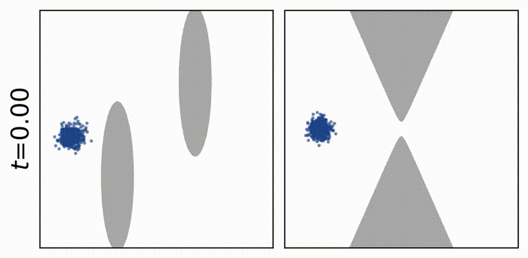
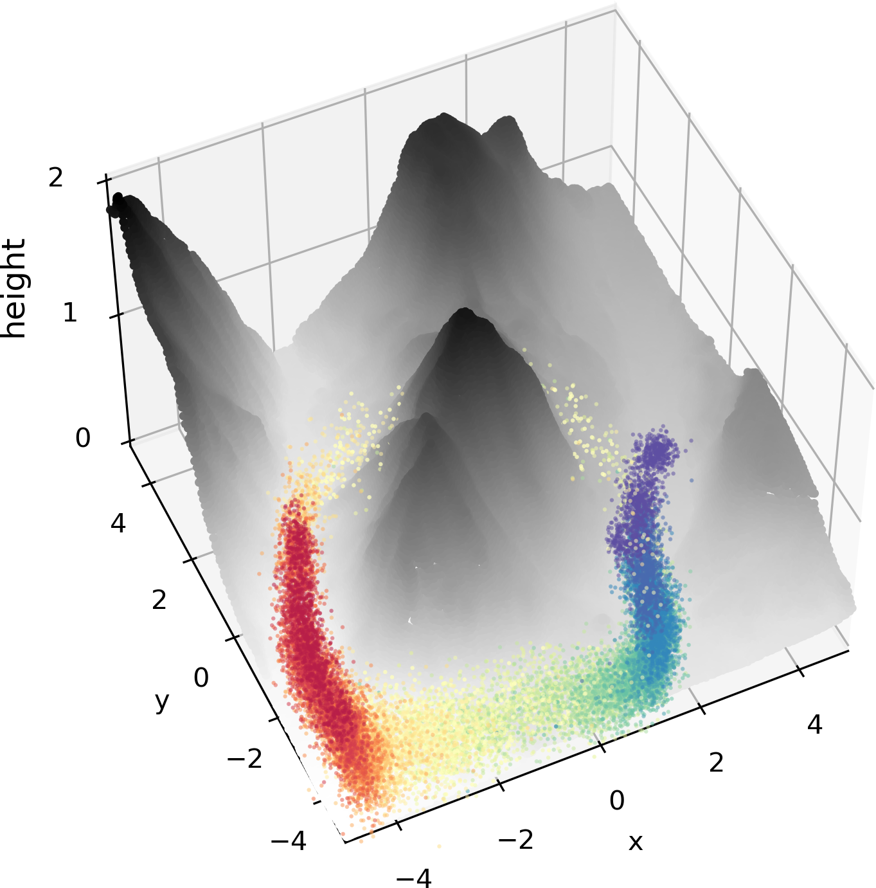
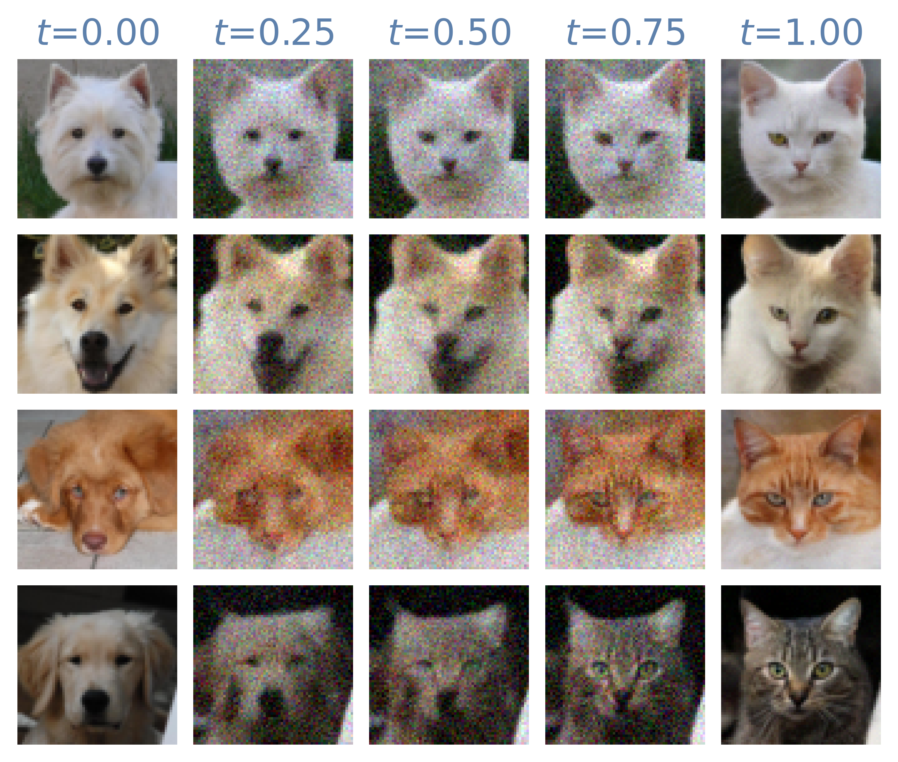

<h1 align='center'>Generalized Schrödinger Bridge Matching (GSBM)</h1>
<div align="center">
  <a href="https://ghliu.github.io/" target="_blank">Guan-Horng Liu</a><sup>1</sup>&ensp;<b>&middot;</b>&ensp;
  <a href="https://www.wisdom.weizmann.ac.il/~ylipman/" target="_blank">Yaron Lipman</a><sup>2,3</sup>&ensp;<b>&middot;</b>&ensp;
  <a href="https://maxn.io/" target="_blank">Maximilian Nickel</a><sup>3</sup>
  <br>
  <a href="https://scholar.google.com/citations?user=Wewcpo4AAAAJ" target="_blank">Brian Karrer</a><sup>3</sup>&ensp;<b>&middot;</b>&ensp;
  <a href="https://sites.gatech.edu/acds/" target="_blank">Evangelos A. Theodorou</a><sup>1</sup>&ensp;<b>&middot;</b>&ensp;
  <a href="https://rtqichen.github.io/" target="_blank">Ricky T. Q. Chen</a><sup>3</sup><br>
  <sup>1</sup>Georgia Tech &emsp; <sup>2</sup>Weizmann Institute of Science &emsp; <sup>3</sup>FAIR, Meta<br>
</div>

<br>

<div align="center">

[](https://arxiv.org/abs/2310.02233)
[](https://x.com/guanhorng_liu/status/1709983646558404913)

</div>

[Generalized Schrödinger Bridge Matching](https://arxiv.org/abs/2310.02233) (**GSBM**) is a new matching algorithm 
for learning diffusion models between two distributions with task-specific optimality structures. 
Examples of task-specific structures include mean-field interaction in population propagation (_1st, 2nd figures_), geometric prior given LiDAR manifold (_3rd figure_), or latent-guided unpaired image translation (_right figure_).


<div align="center">
     &ensp;  &ensp; 
</div>


## Installation
```bash
conda env create -f environment.yml
pip install -e .
```

## Crowd navigation & opinion depolarization
```python
python train.py experiment=$EXP seed=0,1,2,3,4 -m
```
where `EXP` is one of the settings in `configs/experiment/*.yaml`. The commands to generate similar results shown in our paper can be found in [`scripts/train.sh`](https://github.com/facebookresearch/gsbm/blob/main/scripts/train.sh). By default, checkpoints and figures are saved under the folder `outputs`.

## Unsupervised image translation

### Download dataset
Download the official AFHQ dataset from [stargan-v2](https://github.com/clovaai/stargan-v2#animal-faces-hq-dataset-afhq), then preprocess images with
```python
python afhq_preprocess.py --dir $DIR_AFHQ
```
where `DIR_AFHQ` is the path to AFHQ dataset (_e.g._, `../stargan-v2/data/afhq`). 

Download [lidar data](https://rtqichen.com/data/rainier2-thin.las) and place it in `data` folder.

All downloaded files will be stored under the folder `data`.

### Sampling from trained model

See
[`notebooks/afhq_sample.ipynb`](https://github.com/facebookresearch/gsbm/blob/main/notebooks/afhq_sample.ipynb).

### Training from scratch
We train GSBM with 4 nodes, each with 8 32GB V100 GPUs.
```python
python train.py experiment=afhq nnodes=4 -m
```

To sample from a checkpoint $CKPT saved under `outputs/multiruns/afhq/$CKPT`, run
```bash
python afhq_sample.py --ckpt $CKPT --transfer $TRNSF \
    [--nfe $NFE] [--batch-size $BATCH]
```
where `TRNSF` can be either `cat2dog` or `dog2cat`. By default, we set `NFE=1000` and `BATCH=512`. To optionally parallelize the sampling across multiple devices, add `--partition 0_4` so that the dataset is partitioned into 4 subsets (indices 0,1,2,3) and only run the first partition, i.e. index 0. Similarly, `--partition 1_4` run the second partition, and so on. The reconstruction images will be saved under the parent of `outputs/multiruns/afhq/$CKPT`, in the folders named `samples` and `trajs`.

## Implementation

GSBM alternatively solves the Conditional Stochastic Optimal Control (**CondSOC**) problem and the resulting marginal **Matching** problem. We implement GSBM on PyTorch Lightning with the [following configurations](https://github.com/facebookresearch/gsbm/blob/main/train.py#L120-L123):

- We solve **CondSOC** and **Matching** respectively in the validation and training epochs. `pl.Trainer` is instantiated with `num_sanity_val_steps=-1` and `check_val_every_n_epoch=1` so that the validation epoch is executed before the initial training epoch and after each subsequent training epoch. 
- The results of **CondSOC** are gathered in [`validation_epoch_end`](https://github.com/facebookresearch/gsbm/blob/main/gsbm/pl_model.py#L353) and stored as `train_data`, which is then used to initialize [`train_dataloader`](https://github.com/facebookresearch/gsbm/blob/main/gsbm/pl_model.py#L399-L407). We set `reload_dataloaders_every_n_epochs=1` to refreash `train_dataloader` with latest **CondSOC** results.
- For multi-GPU training, we distribute **CondSOC** optimization across each device by setting `replace_sampler_ddp=False` and then instantiating [`val_dataloader`](https://github.com/facebookresearch/gsbm/blob/main/gsbm/pl_model.py#L259-L280) on each device with a different seed.
- The training direction (forward or backward) is altered in [`training_epoch_end`](https://github.com/facebookresearch/gsbm/blob/main/gsbm/pl_model.py#L254), which is called _after_ the validation epoch.

The overall procedure follows

> [validate epoch (sanity)] **CondSOC** with random coupling \
→ [training epoch #0] **Matching** forward drift \
→ [validate epoch #0] **CondSOC** given forward model coupling \
→ [training epoch #1] **Matching** backward drift \
→ [validate epoch #1] **CondSOC** given backward model coupling \
→ [training epoch #2] **Matching** forward drift \
→ ...

If you wish to implement GSBM for your own distribution matching tasks, we recommand fine-tuning the **CondSOC** optimization independently as in [`notebooks/example_CondSOC.ipynb`](https://github.com/facebookresearch/gsbm/blob/main/notebooks/example_CondSOC.ipynb). Once you are happy with the **CondSOC** results, you can seamlessly integrate it into the main GSBM algorithm.

## Citation
If you find this repository helpful for your publications,
please consider citing our paper:
```
@inproceedings{liu2024gsbm,
  title={{Generalized Schr{\"o}dinger bridge matching}},
  author={Liu, Guan-Horng and Lipman, Yaron and Nickel, Maximilian and Karrer, Brian and Theodorou, Evangelos A and Chen, Ricky TQ},
  booktitle={International Conference on Learning Representations},
  year={2024}
}
```

## License
The majority of `generalized-schrodinger-bridge-matching` is licensed under [CC BY-NC](LICENSE.md), however portions of the project are adapted from other sources and are under separate license terms: files from https://github.com/ghliu/deepgsb is licensed under the Apache 2.0 license, and files from https://github.com/openai/guided-diffusion are licensed under the MIT license.
